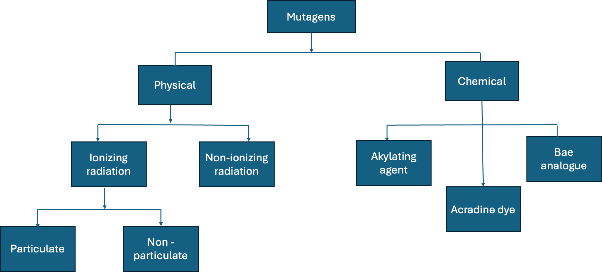

**Introduction**

Taro is one of the important root crops in Nigeria and other tropical countries. It is food for – people in the world ().

Taro is an important staple food in the world especially in the tropics and subtropics. Taro belong to the botanical family Araceae (aroid family).

The world production of the crop for 2023 to 2024 () with Nigeria being the top producer of the crop ().

All parts of the taro are useful as food for both humans and animal. The young leaves are edible and so are the corms and cormels.

#### Growing conditions of taro

#### The Botany of Taro

Taro is usually cultivated vegetatively using the corms and the cormels this is because of the firstly most taro varieties do not flower and or have produce poor seeds and secondly the onset of disease intercepts the time of flower maturation leading to the death of most of the plant hence lack of seeds available for the next planting season. this is a major bottle neck of taro improvement.

#### Genetic Variation in Taro

#### What is Mutation

Mutation is a change in the nucleotide sequence of a short region of a genome. Mutation occurs either due to error in the DNA replication or from the effect of mutagens such as chemicals, heat and irradiation leading to structural changes n the DNA. The change usually affect on one strand of the parent double helix. that is only one strand carries the mutation [@brown2002].

Mutation can be classified based on the scale of the DNA sequence affected by the mutational events. mutation can be either small or large scale.

Small scale mutation involves changes in one or few nucleotides. Small scale mutation includes deletion, insertion and substitution of one or few nucleotides. Substitution is also called point mutation - and it is when one nucleotide is replaces with another nucleotide.

Point mutation occurs in two way; transition and transversion. Translation occurs when a purine is converted to a purine and vice versa. Transversion occurs when a purine is converted to a pyrimidine and vice versa.

Point mutation is of three types, silence mutation, mis-sence mutation and nonsense mutation. Silence mutation occurs when the change in nucleotide of a codon leads to the formation of a new codon that translates into the same amino acid. Mis-sense mutation occurs when the codon is changed into another codon that translates into a different amino acid, and non-sense mutation occurs when the codon is changed into a codon that does not translate any amino acid. The resulting codon (the stop codon) of a non-sense mutation leads to the end of the a translation process.

Large scale mutation affects the entire structure of the chromosome. Large scale mutation involves deletion, duplication, and inversion. Deletion of a large region of the chromosome can lead to loss of genes. Duplication can lead to extra copies of genes. Inversion is when the segment of the chromosome is reversed. Large scale mutation can occur also include insertion of an extra copy of a chromosome, and translocation of sections of the DNA from one location to another location.

fig 1: Types of mutation

Mutation is the main source of all genetic variation that occurs in organisms including plants (Kharkwal 2011). these variation are the source of raw materials needed for natural selection to operate and ring about evolution (Kharkwal 2011) Mutation can be spontaneous. This is when mutation occurs naturally in a population resulting in new phenotype or variation in the population(). spontaneous mutation naturally occurs during adaptation and evolution processes. Mutation can also be deliberately induced to occur.

#### Mutagens what are they?

Mutation involves the use of mutagen. Mutagens are substances or agents that changes the genetic material of an organism [@harding2024]. Mutagens can be physical, chemical and biological ().

Physical mutagens can be classified into agents with ionizing and non-ionizing radiation. Ionizing radiation is divided into the particulate radiation such as alpha rays and the non-particulate radiation such as X-rays and gamma rays (). Non-ionizing radiation include Ultraviolent light

Mutation also involves the use of chemical mutagens such ethyl ethyl methanesulfonate (EMS) to induce spontaneous genetic variation in plant to develop new crop varieties [@cvejic2026] one of the advantages of mutation breeding is that it increases the genetic diversity. Mutation can also be induced using biotechnological processes (Kharkwal 2011)

#### Mutation breeding for crop improvement

Crop improvements can be made when sufficient variation for a given trait of interest is available within the gene pool of the crop. In many cases, the desired variation may exist in out-dated varieties, old landraces (Forstera and Shu 2011). to harness these desired variations from the elite varieties or landraces into the new lines will involve long breeding process which might be less appealing to the plant breeder. A much better approach is to cause variation in the new lines without undergoing so several crosses and selection. Mutation breeding is one method that can create variation without involving crossing.

Freisleben and Lein (1944) first defined the term mutation breeding as the deliberate induction and development of mutant lines for crop improvement (Forstera and Shu 2011). Mutation breeding is a processes of creating variation in plant by intentionally inducing mutations and utilize them for crop improvement.

Genetic diversity is important to plant breeders because it allows for the selection of new traits. Although mutants can be produced using different mutagens, mutation breeding is restricted to the use of physical and chemical mutagens (Forstera and Shu 2011).

Mutation breeding can be useful in plants with narrow genetic base like taro. Taro breeders are seeking for ways to overcome the problem of seed availability and have employed method such as staggering the planting time to escape disease the peak of disease outbreak. Mutation breeding is one method that breeders can employ to increase genetic diversity of taro. There is need to understand what mutation is before we think of mutation breeding

#### Principles and application of mutation breeding

#### Problems of Mutation Breeding

Although mutation breeding creates diversity and increases genetic base, it is not left with some negative effects. Mutation breeding is random and unpredictable which result to the development of crops with high proportion of deleterious or neutral traits along side crops with the desired traits @mutanda2025. Because many random traits are produced using mutation breeding, more time and resources are channeled into screening of the large mutant population (Shahwar et al 2023).

Due to the low change of obtaining the mutants with desired trait of interest, there is need for efficient management of the population to select superior mutants @mutanda2025.

Mutation breeding is affected by genotype by environmental interaction (GEI). GEI could affect the accuracy of mutation. There is need to test these superior mutant in multiple locations and years to understand the extent of GEI effects. Testing the mutant in multiple location can leads toextended breeding cycle.

An approach that reduces the breeding cycle can be included alongside mutation breeding to reduce the time it take for the mutation breeding cycle to complete.

#### Genomic Selection

#### Genomic selection and mutation breeding workflow

 \#### Conclusion

**References**

Freisleben, R.A. and Lein, A. 1944. Möglichkeiten und praktische Durchführung der Mutationszüchtung. Kühn-Arhiv. 60: 211-22.

Forstera B.P. and Shu Q.Y. 2011 Plant Mutagenesis in Crop Improvement: Basic Terms and Applications in Shu Q.Y., Forster B.P., and Nakagawa H. edited Plant Mutation Breeding and Biotechnology. Plant Breeding and Genetics Section Joint FAO/IAEA Division of Nuclear Techniques in Food and Agriculture International Atomic Energy Agency, Vienna, Austria

Kharkwal M.C. 2011 A Brief History of Plant Mutagenesis in Shu Q.Y., Forster B.P., and Nakagawa H. edited Plant Mutation Breeding and Biotechnology. Plant Breeding and Genetics Section Joint FAO/IAEA Division of Nuclear Techniques in Food and Agriculture International Atomic Energy Agency, Vienna, Austria

Shahwar, D., Ahn, N., Kim, D., Ahn, W., and Park, Y. (2023). Mutagenesis-based plant breeding approaches and genome engineering: a review focused on tomato. Mut. Res. Rev. Mut. Res. 792:108473. doi: 10.1016/j.mrrev.2023.108473
