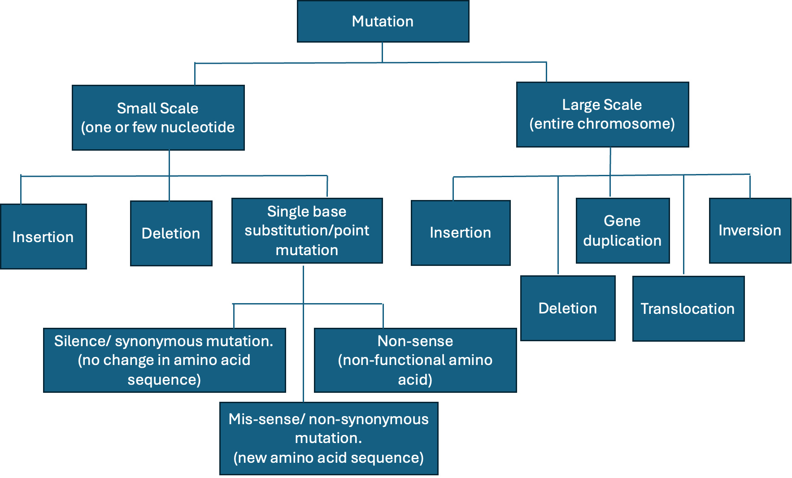

---
word_document:
  reference_docx: reference.docx
author: "Chinedozi Amaefula and Dr Joseph Onyeka"
date: "`r Sys.Date()`"
output: word_document
fontsize: 12pt
fonttype: Times New Roman
title: "Integrating mutation breeding and genomic selection in Taro"
bibliography: references.bib
mainfont: Times New Roman
---

**Introduction**

Taro is one of the important root crops in Nigeria and other tropical countries. It is food for – people in the world ().

Taro is an important staple food in the world especially in the tropics and subtropics. Taro belong to the botanical family Araceae (aroid family).

The world production of the crop for 2023 to 2024 () with Nigeria being the top producer of the crop ().

All parts of the taro are useful as food for both humans and animal. The young leaves are edible and so are the corms and cormels. Growing conditions of taro

#### The botany of Taro

Taro is usually cultivated vegetatively using the corms and the cormels this is because of the firstly most taro varieties do not flower and or have produce poor seeds and secondly the onset of disease intercepts the time of flower maturation leading to the death of most of the plant hence lack of seeds available for the next planting season. this is a major bottle neck of tara improvement.

Taro breeders are seeking for ways to overcome the problem of seed availability and have employed method such as staggering the planting time to escape disease the peak of disease outbreak. Mutation breeding is one method that breeders can employ to increase genetic diversity of taro. there is need to understand what mutation is before we think of mutation breeding

#### What is Mutation

Mutation is a change in the nucleotide sequence of a short region of a genome. Mutation occurs either due to error in the DNA replication or from the effect of mutagens such as chemicals, heat and irradiation leading to structural changes n the DNA. The change usually affect on one strand of the parent double helix. that is only one strand carries the mutation [@brown2002].

Mutation can be classified based on the scale of the DNA sequence affected by the mutational events. mutaion can be either small or large scale.

Small scale mutation involves changes in one or few nucleotides. Small scale mutation includes deletion, insertion and substitution of one or few nucleotides. Substitution is also called point mutation - and it is when one nucleotide is replaces with another nucleotide. Point mutation occurs in two way; transition - when a purine is converted to a purine and vice versa. Transversion is when a purine is converted to a pyrimidine and vice versa. Point mutation is of three types, silence mutation, missence mutation and nonsense mutation. Silence mutation occurs when the change in nucleotide of a codon leads to the formation of a new codon that translates into the same amino acid. Mis-sense mutation occurs when the codon is changed into another codon that translates into a different amino acid, and non-sense mutation occurs when the codon is changed into a codon that does not translate any amino acid. The resulting codon (the stop codon) of a non-sense mutation leads to the end of the a translation process.

Large scale mutation affects the entire structure of the chromosome. Large scale mutation involves deletion of a large region of the chromosome leading to loss of genes, and duplication of a single chromosome. Duplication can lead to extra copies of genes, and inversion is when the segment of the chromosome is reversed. Large scale mutation can occur also include insertion of an extra copy of a chromosome, and translocation of sections of the DNA from one location to another location.

fig 1: Types of mutation

Mutation is the source of most genetic variation. Mutation can be spontaneous. This is when mutation occurs naturally in a population resulting in new phenotype or variation in the population(). spontaneous mutation naturally occurs during adaptation and evolution processes. Mutation can also be delibrately induced to occur.

mutati

#### Mutation breeding for crop improvement

Crop improvements can be made when sufficent variation for a given trait of interest is available within the gene pool of the crop. In many cases, the desired variation may exist in out-dated varieties, old landraces (Forstera and Shu 2011). to harness these desired variations from the elite varieties or landraces into the new lines will involve long breeding process which might be less appealing to the plant breeder. A much better approach is to cause variation in the new lines without undergoing so several crosses and selection. Mutation breeding is one method that can create variation without involving crossing.

Freisleben and Lein (1944) first defined the term mutation breeding as the deliberate induction and development of mutant lines for crop improvement (Forstera and Shu 2011). Mutation breeding is a processes of creating variation in plant by intentionally inducing mutations and utilize them for crop improvement.

It involves the use of physical mutagens like ionized radiation such as x-rays, gammar rays and fast neutron. These radiations alter the DNA structure of plants. Mutation also involves the use of chemical mutagens such ethyl ethyl methanesulfonate (EMS) to induce spontaneous genetic variation in plant to develop new crop varieties [@cvejic2026] one of the advantages of mutation breeding is that it increases the genetic diversity. Genetic diversity is important to plant breeders because it allows for the selection of new traits. Although mutants can be produced using different mutagens, mutation breeding is restricted to the use of physical and chemical mutagens (Forstera and Shu 2011).

Mutation breeding can be useful in plants with narrow genetic base like taro.

#### Principles and application of mutation breeding

induce mutation wethere due to physical or chemical mutagens occur at random across the gemone or within any locus or gene ()

#### Genomic selection and mutation breeding workflow

**References**

Freisleben, R.A. and Lein, A. 1944. Möglichkeiten und praktische Durchführung der Mutationszüchtung. Kühn-Arhiv. 60: 211-22.

Forstera B.P. and Shu Q.Y. 2011 Plant Mutagenesis in Crop Improvement: Basic Terms and Applications in Shu Q.Y. , Forster B.P., and Nakagawa H. edited Plant Mutation Breeding and Biotechnology. Plant Breeding and Genetics Section Joint FAO/IAEA Division of Nuclear Techniques in Food and Agriculture International Atomic Energy Agency, Vienna, Austria
